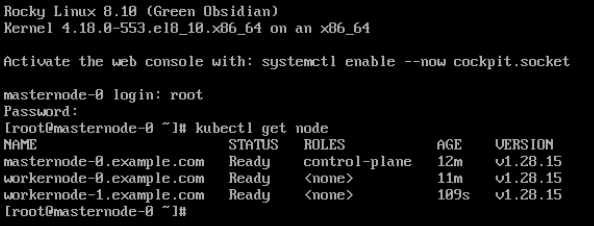

# Automated Kubernetes Cluster Provisioning with Terraform & Ansible (on KVM)

## Overview

This project automates the provisioning and configuration of a Kubernetes cluster using Terraform and Ansible on KVM (Libvirt). It ensures consistent setup across environments, eliminating configuration drift and enabling reproducible deployments.

Stack Used:
- Terraform (Infrastucture Provisioning)
- Ansible (configuration & Kubernetes Setup)
- KVM / libvirt (virtualization platform)
- Rocky linux 8

## Project Structure

```bash
k8s-automation-lab/
├── main.tf
├── variables.tf
├── provider.tf
├── outputs.tf
├── conf/
│   ├── user_data.yaml
│   └── network_config.yaml
├── ansible/
│   ├── install-k8s.yml
│   └── inventory/
│       └── terraform_inventory.ini
└── README.md
```

## Environment
KVM & Libvirt installed on host (libvirt-daemon, virt-manager, qemu-kvm)

- Terraform >= 1.4.x
- Ansible >= 2.14.x
- SSH key access configured

## Terraform Setup

### Initialize Project

```bash
mkdir kubernetes-setup
cd kubernetes-setup
terraform init
```

### Provider Configuration (`provider.tf`)

```hcl
provider "libvirt" {
  uri = "qemu:///system"
}
```

### Variables (`variable.tf`)

Main variables include:
- libvirt_pool_name → KVM storage pool
- base_image_path → Base image for VM creation
- master_count, worker_count → Node scaling
- master_ip_address, worker_ip_address → Static IP assignment
- ssh_username, ssh_private_key → SSH credentials

Full variable definitions available in [variable.tf](variable.tf)

## Main Terraform Logic

The `main.tf` provisions:

- Master and worker VMs
- Volumes and cloud-init disks
- Network and SSH configuration
- Ansible automation trigger after provisioning

Key resource example:

```hcl
resource "null_resource" "run_ansible" {
  depends_on = [
    libvirt_domain.master_node,
    libvirt_domain.worker_node
  ]

  provisioner "local-exec" {
    command = <<EOT
      echo "[masters]" > ansible/inventory/terraform_inventory.ini
      for ip in ${join(" ", var.master_ip_address)}; do
        echo "$ip" >> ansible/inventory/terraform_inventory.ini
      done

      echo "[workers]" >> ansible/inventory/terraform_inventory.ini
      for ip in ${join(" ", var.worker_ip_address)}; do
        echo "$ip" >> ansible/inventory/terraform_inventory.ini
      done

      ansible-playbook -i ansible/inventory/terraform_inventory.ini ansible/install-k8s.yml
    EOT
  }
}
```

See [main.tf](main.tf) for the full libvirt VM, network, and storage configuration


## Cloud-init Configuration

Define under `conf/` directory

`network_config.yml`

```yaml
version: 2
ethernets:
  eth0:
    dhcp4: false
    addresses:
      - ${ip_address}/24
    gateway4: 192.168.122.1
    nameservers:
      addresses: [8.8.8.8]
```

`user_data.yaml`

```yaml
#cloud-config
hostname: ${hostname}
ssh_pwauth: true
disable_root: false
users:
  - name: abint
    sudo: ALL=(ALL) NOPASSWD:ALL
    ssh-authorized-keys:
      - <your-ssh-pub-key>
```

## Deployment Steps

1. Plan the deployment

```bash
terraform plan
```

2. Apply configuration

```bash
terraform apply
```

3. Verify VM status

```bash
virsh list
```

Example:

```bash
 Id   Name           State
------------------------------
 29   workernode-1   running
 30   workernode-0   running
 31   masternode-0   running
```

## Validate Kubernetes Cluster

After Ansible finishes installing Kubernetes:

```bash
kubectl get nodes
```

Expected output:

```bash
NAME            STATUS   ROLES           AGE   VERSION
masternode-0    Ready    control-plane   10m   v1.30.0
workernode-0    Ready    <none>          8m    v1.30.0
workernode-1    Ready    <none>          8m    v1.30.0
```




## Notes

For complete variable and resource configuration, see:
- [variable.tf](variable.tf)
- [main.tf](main.tf)
- [ansible/install-k8s.yml](ansible/install-k8s.yml)

## References
- [https://computingforgeeks.com/how-to-install-terraform-on-linux/](https://computingforgeeks.com/how-to-install-terraform-on-linux/)
- [https://dev.to/ruanbekker/terraform-with-kvm-2d9e](https://dev.to/ruanbekker/terraform-with-kvm-2d9e)
- [https://computingforgeeks.com/how-to-provision-vms-on-kvm-with-terraform/](https://computingforgeeks.com/how-to-provision-vms-on-kvm-with-terraform/)
- [https://github.com/Mosibi/centos8-terraform](https://github.com/Mosibi/centos8-terraform)
